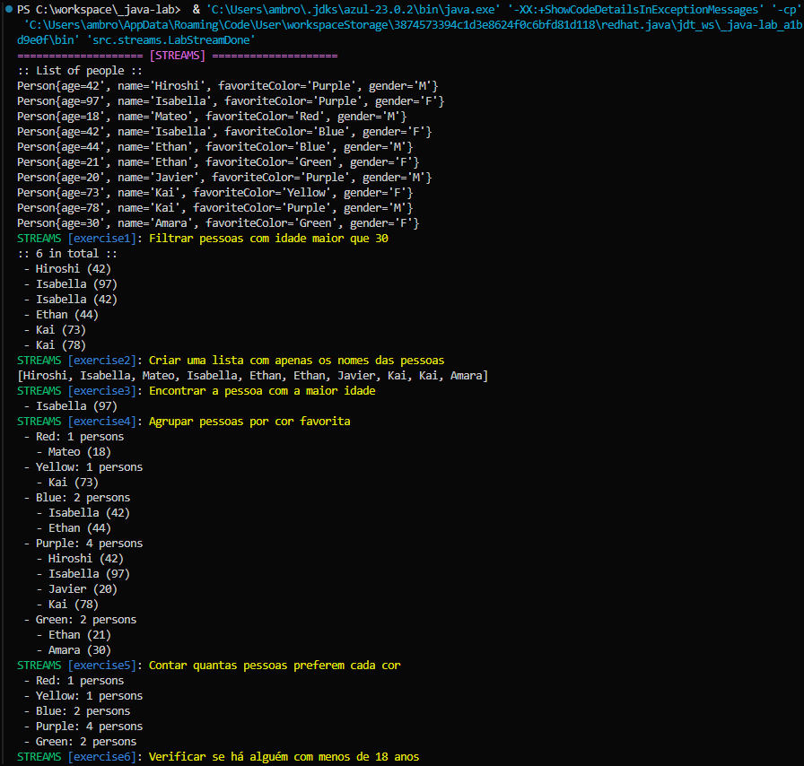

# Java Lab

Repositório com exemplos práticos e didáticos das funcionalidades da linguagem Java, focado em fundamentos, sem uso de frameworks externos. Ideal para quem deseja aprender Java na prática, entendendo os conceitos básicos e intermediários.

> 🇺🇸 This project is also available in English: [README.md](README.md)

---

## 🌐 Internacionalização (i18n)

Este projeto suporta outro idioma. Para alternar entre inglês e português, basta alterar o arquivo `.env`:

```sh
app.profile=en   # Para inglês
# app.profile=pt  # Para português
```

### 🧩 Classes auxiliares para internacionalização

- **[CustomPrint](src/main/java/config/CustomPrint.java)** – Impressão customizada no console, com suporte a cores e formatação.
- **[MessageProvider](src/main/java/config/MessageProvider.java)** – Carregamento e gerenciamento das mensagens conforme o idioma.
- **[ConfigLanguage](src/main/java/config/ConfigLanguage.java)** – Configurações globais relacionadas à linguagem e localização.

<details>
<summary><b>Imagens</b></summary>

 

</details>

---

## 🚀 Tecnologias utilizadas

[![Java][java-shield]][java-url] [![Internationalization][i18n-shield]][i18n-url] [![Build with Gradle][gradle-shield]][gradle-url]

---

## 📚 Conteúdo e estrutura

| Status | Tema                       | README                                                                                            | Cheat Sheet                               | Exercícios                                    |
| ------ | -------------------------- | ------------------------------------------------------------------------------------------------- | ----------------------------------------- | --------------------------------------------- |
| ☑️     | **Streams**                | [Português 🇧🇷](docs/streams/README.pt-BR.md) / [English 🇺🇸](docs/streams/README.en-US.md)         | [🇧🇷](docs/streams/cheatcode.pt-BR.md)     | [🇧🇷 / 🇺🇸](docs/streams/exercise.en-pt.md)     |
| ☑️     | **Records**                | [Português 🇧🇷](docs/records/README.pt-BR.md) / [English 🇺🇸](docs/records/README.en-US.md)         | [🇧🇷](docs/records/cheatcode.pt-BR.md)     | [🇧🇷 / 🇺🇸](docs/records/exercise.en-pt.md)     |
| 🚧     | **Optionals**              | [Português 🇧🇷](docs/optionals/README.pt-BR.md) / [English 🇺🇸](docs/optionals/README.en-US.md)     | [🇧🇷](docs/optionals/cheatcode.pt-BR.md)   | [🇧🇷 / 🇺🇸](docs/optionals/exercise.en-pt.md)   |
| 🚧     | **Lambdas**                | [Português 🇧🇷](docs/lambdas/README.pt-BR.md) / [English 🇺🇸](docs/lambdas/README.en-US.md)         | [🇧🇷](docs/lambdas/cheatcode.pt-BR.md)     | [🇧🇷 / 🇺🇸](docs/lambdas/exercise.en-pt.md)     |
| 🚧     | **Collections**            | [Português 🇧🇷](docs/collections/README.pt-BR.md) / [English 🇺🇸](docs/collections/README.en-US.md) | [🇧🇷](docs/collections/cheatcode.pt-BR.md) | [🇧🇷 / 🇺🇸](docs/collections/exercise.en-pt.md) |
| 🚧     | **Date time**              | [Português 🇧🇷](docs/date_time/README.pt-BR.md) / [English 🇺🇸](docs/date_time/README.en-US.md)     | [🇧🇷](docs/date_time/cheatcode.pt-BR.md)   | [🇧🇷 / 🇺🇸](docs/date_time/exercise.en-pt.md)   |
| 🚧     | **Concurrency**            | [Português 🇧🇷](docs/concurrency/README.pt-BR.md) / [English 🇺🇸](docs/concurrency/README.en-US.md) | [🇧🇷](docs/concurrency/cheatcode.pt-BR.md) | [🇧🇷 / 🇺🇸](docs/concurrency/exercise.en-pt.md) |
| 🚧     | **Generics**               | [Português 🇧🇷](docs/generics/README.pt-BR.md) / [English 🇺🇸](docs/generics/README.en-US.md)       | [🇧🇷](docs/generics/cheatcode.pt-BR.md)    | [🇧🇷 / 🇺🇸](docs/generics/exercise.en-pt.md)    |
| 🚧     | **IO NIO**                 | [Português 🇧🇷](docs/io_nio/README.pt-BR.md) / [English 🇺🇸](docs/io_nio/README.en-US.md)           | [🇧🇷](docs/io_nio/cheatcode.pt-BR.md)      | [🇧🇷 / 🇺🇸](docs/io_nio/exercise.en-pt.md)      |
| 🚧     | **HttpClient**             | [Português 🇧🇷](docs/http_client/README.pt-BR.md) / [English 🇺🇸](docs/http_client/README.en-US.md) | [🇧🇷](docs/http_client/cheatcode.pt-BR.md) | [🇧🇷 / 🇺🇸](docs/http_client/exercise.en-pt.md) |
| 🚧     | **JDBC**                   | [Português 🇧🇷](docs/jdbc/README.pt-BR.md) / [English 🇺🇸](docs/jdbc/README.en-US.md)               | [🇧🇷](docs/jdbc/cheatcode.pt-BR.md)        | [🇧🇷 / 🇺🇸](docs/jdbc/exercise.en-pt.md)        |
| 🚧     | **Functional Programming** | [Português 🇧🇷](docs/func_prog/README.pt-BR.md) / [English 🇺🇸](docs/func_prog/README.en-US.md)     | [🇧🇷](docs/func_prog/cheatcode.pt-BR.md)   | [🇧🇷 / 🇺🇸](docs/func_prog/exercise.en-pt.md)   |
| 🚧     | **Benchmarks**             | [Português 🇧🇷](docs/benchmarks/README.pt-BR.md) / [English 🇺🇸](docs/benchmarks/README.en-US.md)   | [🇧🇷](docs/benchmarks/cheatcode.pt-BR.md)  | [🇧🇷 / 🇺🇸](docs/benchmarks/exercise.en-pt.md)  |
| 🚧     | **Exceptions**             | [Português 🇧🇷](docs/exceptions/README.pt-BR.md) / [English 🇺🇸](docs/exceptions/README.en-US.md)   | [🇧🇷](docs/exceptions/cheatcode.pt-BR.md)  | [🇧🇷 / 🇺🇸](docs/exceptions/exercise.en-pt.md)  |

---

### 🤝 Contribuindo

Contribuições são bem-vindas!
Se quiser ajudar a melhorar este projeto, sinta-se à vontade para fazer um _fork_, criar sua branch e abrir um _pull request_.

---

### 🐱‍👤 Autora

**Ambrósia Andrade** 🇧🇷

[![GitHub][github-shield]][github-url] [![LinkedIn][linkedin-shield]][linkedin-url] [![Gmail][gmail-shield]][gmail-url] [![Instagram][instagram-shield]][instagram-url]

---

### 📝 Licença

Este projeto está licenciado sob a **[Licença MIT](LICENSE)** — veja o arquivo para mais detalhes.

---

> Feito com ❤️ usando java. Ideal para aprendizado ou referência.

[](https://github.com/ambrosiaandrade/java-lab/stargazers)
[](https://github.com/ambrosiaandrade/java-lab)

<!-- MARKDOWN LINKS & IMAGES -->

[java-shield]: https://img.shields.io/badge/Java-21-007396?style=for-the-badge&logo=java&logoColor=white
[java-url]: https://www.oracle.com/java/
[i18n-shield]: https://img.shields.io/badge/Internationalization-i18n-blue?style=for-the-badge
[i18n-url]: https://en.wikipedia.org/wiki/Internationalization_and_localization
[gradle-shield]: https://img.shields.io/badge/Build%20with-Gradle-02303A.svg?style=for-the-badge&logo=gradle
[gradle-url]: https://gradle.org/

<!-- Social media -->

[instagram-shield]: https://img.shields.io/badge/-Instagram-E4405F?style=for-the-badge&logo=instagram&logoColor=white
[instagram-url]: https://www.instagram.com/ambrosia_andrade_br/
[linkedin-shield]: https://img.shields.io/badge/-LinkedIn-black.svg?style=for-the-badge&logo=linkedin&colorB=blue
[linkedin-url]: https://linkedin.com/in/ambrosiaandrade
[gmail-shield]: https://img.shields.io/badge/-Gmail-EA4335?style=for-the-badge&logo=gmail&logoColor=white
[gmail-url]: mailto:ambrosiaandrade.pe@gmail.com
[github-shield]: https://img.shields.io/badge/-GitHub-181717?style=for-the-badge&logo=GitHub&logoColor=white
[github-url]: https://github.com/ambrosiaandrade
