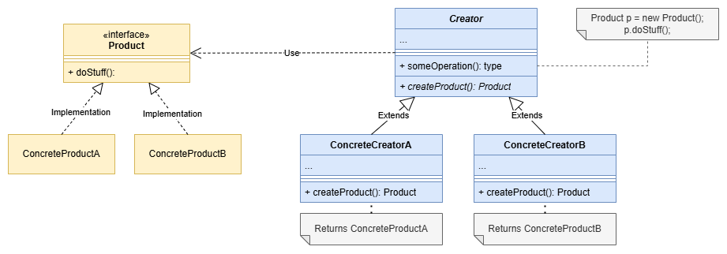

# 💡 Cheatsheet - pt-BR

---

### **Componentes Principais do Padrão Factory Method**



1. **Interface Product (Produto)**

   - Representa a interface comum dos objetos que serão criados.
   - Na imagem: `Product`.

2. **Concrete Products (Produtos Concretos)**

   - Implementam a interface `Product`.
   - Na imagem: `ConcreteProductA` e `ConcreteProductB`.

3. **Creator (Criador)**

   - Define o método de fábrica (`factoryMethod()`), que retorna um objeto do tipo `Product`.
   - Pode conter alguma lógica de negócio que usa o `Product` retornado.
   - Na imagem: `Creator` com o método `factoryMethod()`.

4. **Concrete Creators (Criadores Concretos)**

   - Implementam o método de fábrica para retornar instâncias específicas de `Product`.
   - Na imagem: `ConcreteCreatorA` e `ConcreteCreatorB`, que retornam `ConcreteProductA` e `ConcreteProductB`, respectivamente.

5. **Uso**

   - Em vez de criar objetos diretamente com `new`, o código cliente chama o método de fábrica (`factoryMethod()`), delegando a criação do objeto ao criador concreto.
   - Esse ponto está destacado no canto superior direito da imagem, com o código:

     ```java
     Product p = new Product();
     p.doStuff();
     ```
---

#### Fontes
- [Refactoring guru: Factory method](https://refactoring.guru/design-patterns/factory-method)
