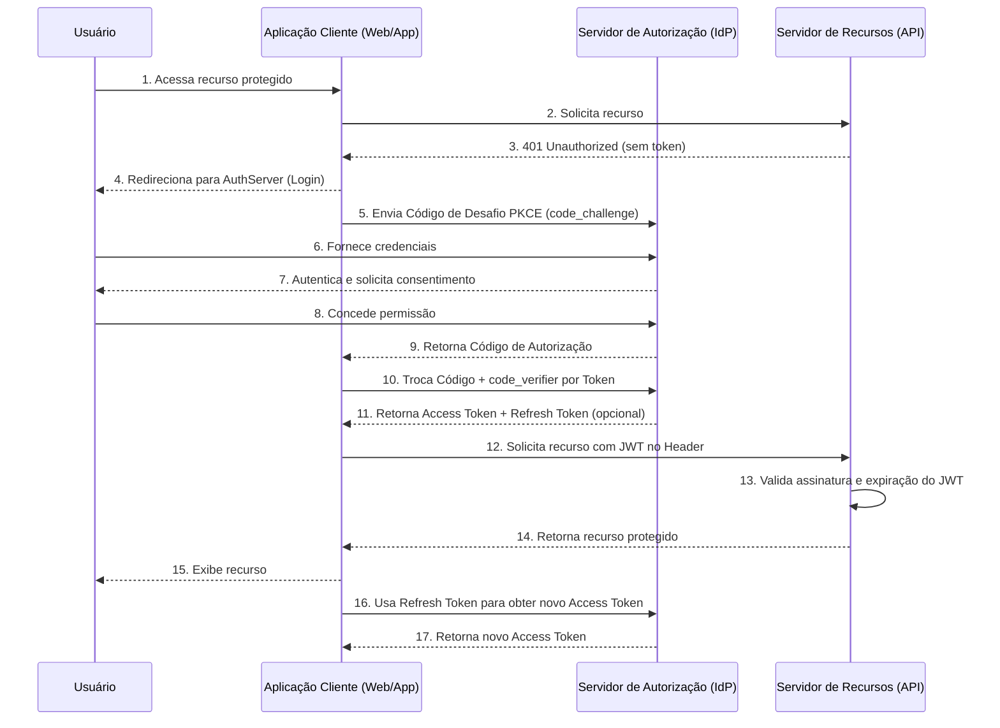

# OpenFinance - Capture [gpt-5]

## Guided study plan (Pleno → Sênior progression)

Foundation (Reinforce Now):

- Core Java: Collections internals, Stream pipeline costs, immutability, records, Optional best practices.
- Error Handling: Checked vs unchecked strategy, domain exceptions vs infrastructure.
- Java Time API, localization, formatting, serialization pitfalls.

Concurrency & Performance:

- Threads, Executors, ForkJoinPool, CompletableFuture composition patterns.
- Virtual Threads (Project Loom) and structured concurrency.
- Synchronization (locks, atomics), false sharing, contention analysis.
- Reactive paradigms (Project Reactor basics) vs imperative trade-offs.
- Profiling (JFR, async-profiler), GC tuning (G1, ZGC basics).

JVM & Runtime:

- Classloading, memory model (JMM), happens-before rules.
- Escape analysis, allocation patterns, object pooling (when NOT to).
- Garbage collectors comparison and tuning heuristics.

Spring & Ecosystem (Deep Dive):

- Auto-configuration internals, condition evaluation.
- `@ConfigurationProperties` binding vs `@Value`.
- Transaction propagation (even if Mongo NoSQL—understand ACID in RDBMS).
- Spring AOP (proxies, CGLIB vs JDK).
- Observability: Micrometer, OpenTelemetry integration.
- Actuator customization, health indicators, liveness/readiness.

Data & State:

- MongoDB: Index design, query planning (`explain`), schema versioning, optimistic concurrency alternatives.
- Redis: Expiration policies, pub/sub vs streams, caching patterns (Cache-Aside, Write-Through).
- Kafka: Partitions, ordering, idempotence, transactions, consumer rebalancing, offset strategies, dead-letter topics.

Architecture & Design:

- Hexagonal / Clean Architecture layering and boundaries.
- DDD strategic patterns: Bounded Context, Context Mapping.
- Tactical DDD: Aggregates, Value Objects, Domain Events.
- Microservices patterns: Circuit Breaker, Retry, Bulkhead, Saga orchestration vs choreography, CQRS, Event Sourcing (when/not).
- API Design: Versioning, idempotency, pagination, error semantics, Problem Details (RFC 7807).
- Resilience tooling: Resilience4j (timeouts, rate limiter, cache, retry).
- Security: OAuth2/OIDC flows, JWT structure, token hardening, mTLS basics.

Testing Maturity:

- Unit vs slice tests (`@WebMvcTest`, `@DataMongoTest`) vs full integration.
- Contract Testing (Spring Cloud Contract).
- Testcontainers for Mongo/Redis/Kafka reproducibility.
- Property-based testing (jqwik / QuickTheories) for domain invariants.
- Mutation testing (PIT) to harden logic.
- Performance and load testing (Gatling / k6).
- Chaos testing basics (fault injection).

DevOps & Delivery:

- Docker image hardening (distroless, layers).
- CI/CD pipelines (quality gates, security scans—Snyk/OWASP).
- Kubernetes basics: readiness/liveness, resource limits, autoscaling.
- Git branching strategies, trunk-based vs GitFlow.

Observability & Reliability:

- Structured logging (JSON), correlation IDs (MDC).
- Distributed tracing spans (Kafka message propagation).
- Metrics (RED/USE), dashboards (Grafana).
- Alert design (meaningful SLOs, error budget).

Security & Compliance:

- OWASP Top 10 mapping to code (e.g., deserialization, injection).
- Secrets management (Vault, KMS).
- Data classification & masking in logs.

Soft / Senior-Level Skills:

- Trade-off articulation (consistency vs availability).
- RFC reading, backward compatibility planning.
- Technical debt quantification and remediation strategies.
- Mentoring / code review heuristics.

Suggested Practice Projects:

1. Refactor error handling to `ProblemDetail`, add Resilience4j (timeout + retry + circuit breaker) around external gateway.
2. Introduce Testcontainers-based integration test suite (Mongo, Redis, Kafka).
3. Add structured logging + trace propagation (OpenTelemetry).
4. Implement idempotent Kafka producer with transactional outbox pattern (simulate at-least-once vs exactly-once).
5. Add contract tests for external REST gateway.

# Chat - Orchestrator [gemini 2.5 pro]

Based on the provided context, here is a complete analysis of the microservice.

## Technology Summary

The `pom.xml` file was not provided, but based on the file structure and the code in `ExceptionUtil.java`, we can infer the following technologies and dependencies:

- **Spring Boot:** The core framework for building the microservice. This is evident from the `application-*.yml` files, the use of `HttpStatus`, and the typical project structure.
- **Spring Web:** Used for creating REST APIs. The `HttpStatus` class is part of this module.
- **Lombok:** A library to reduce boilerplate code (e.g., getters, setters, constructors, loggers). The `@Slf4j` annotation is a clear indicator.
- **Jackson:** A library for processing JSON. It's explicitly used in `ExceptionUtil` via `ObjectMapper` for serializing/deserializing error responses. The `JavaTimeModule` is used to handle Java 8 date/time types correctly.
- **OpenFeign:** A declarative REST client. The presence of `feign.FeignException` shows it's used for communication between microservices.
- **JUnit & Mockito (Implied):** The `surefire-reports` directory contains test results, which is standard for projects using Maven with JUnit. Testing frameworks like Mockito are typically used alongside JUnit for creating mocks.
- **JaCoCo:** Used for measuring code coverage during tests. The `jacoco.exec` file and `site/jacoco/` directory confirm its use.
- **Checkstyle & PMD:** Static code analysis tools to enforce coding standards and find potential bugs. The presence of configuration files (`checkstyle-*.xml`, `pmd.xml`) and reports confirms their integration.
- **Maven:** The build automation and dependency management tool for the project.

## Study Plan for Mid to Senior Level Interviews

This plan is based on the project's context and progresses from mid-level (Pleno) to senior-level topics.

### **Phase 1: Solidify Mid-Level (Pleno) Foundations**

- **Spring Boot Core:**
  - **Dependency Injection:** Deeply understand `@Autowired`, constructor injection vs. field injection, and the Spring IoC container.
  - **Stereotype Annotations:** Master `@Component`, `@Service`, `@Repository`, and `@Controller`/`@RestController`.
  - **Configuration:** Practice using `@Configuration`, `@Bean`, and `@Value`/`@ConfigurationProperties`. Explain the hierarchy of property sources.
  - **REST APIs:** Be able to build a complete CRUD API, including validation (`@Valid`) and exception handling (`@ControllerAdvice`, `@ExceptionHandler`).
- **Design Patterns:**
  - Go beyond definitions. Be able to identify and implement core GoF patterns: **Factory**, **Singleton**, **Builder**, **Adapter**, **Facade**, **Strategy**, and **Observer**. Relate them to how frameworks like Spring use them internally (e.g., `BeanFactory`, `JdbcTemplate` uses Template Method).
- **Testing:**
  - **JUnit & Mockito:** Be proficient in writing unit tests (`@Test`), mocking dependencies (`@Mock`, `@InjectMocks`), and verifying behavior (`when`, `verify`).
  - **Integration Testing:** Practice with `@SpringBootTest` and `MockMvc` to test the web layer.

### **Phase 2: Advance to Senior-Level Topics**

- **Concurrency:**
  - **Java Memory Model:** Understand `volatile`, `synchronized`, and the `java.util.concurrent` package (Executors, `ConcurrentHashMap`, Locks).
  - **Asynchronous Programming:** Master `CompletableFuture`. Study `@Async` in Spring and its implications (thread pools, return types).
- **Advanced Spring:**
  - **Spring Security:** Understand the basics of authentication and authorization, filter chains, and JWT.
  - **Spring Data JPA:** Go beyond basic repositories. Understand lazy vs. eager loading, the N+1 problem, transactions (`@Transactional`), and custom queries.
  - **Spring AOP:** Understand the concepts of Aspects, Pointcuts, and Advice. Explain how `@Transactional` and `@Async` use AOP.
- **Microservice Architecture:**
  - **Communication:** Compare REST vs. asynchronous messaging (e.g., RabbitMQ, Kafka). Understand patterns like API Gateway, Service Discovery (Eureka, Consul), and Centralized Configuration (Spring Cloud Config).
  - **Resilience:** Study patterns like **Circuit Breaker** (Resilience4j, formerly Hystrix), **Retry**, and **Fallback**. Your `ExceptionUtil` is a basic form of this.
  - **Distributed Tracing:** Understand the purpose of tools like OpenTelemetry (which is in your project structure) for tracing requests across multiple services.
- **Databases & Caching:**
  - Understand SQL vs. NoSQL trade-offs.
  - Be able to discuss database indexing, query optimization, and transaction isolation levels.
  - Learn caching strategies (e.g., cache-aside) and tools like Redis.
- **System Design:**
  - Practice solving system design interview questions (e.g., "Design Twitter," "Design a URL shortener"). Focus on scalability, availability, and fault tolerance. This is where you combine all the knowledge from the other topics.

# Chat - lib-ticket [claude sonnet 4]

Com base na análise do código, aqui está uma avaliação completa para sua preparação técnica:

## 1. Tecnologias Utilizadas

### Principais Dependências (inferidas do código):

- **Spring Framework**: Usado para injeção de dependência (`@Service`, `@Value`, `InitializingBean`)
- **Lombok**: Para redução de boilerplate (`@Slf4j`, builders)
- **Nimbus JOSE + JWT**: Biblioteca para manipulação de JWE (JSON Web Encryption)
- **Maven**: Gerenciamento de dependências e build

### Propósito do Microsserviço:

Sistema de geração e validação de tokens JWT criptografados para autenticação em chat corporativo.

## 2. Padrões de Projeto Identificados

### Implementados:

- **Service Layer Pattern**: Separação da lógica de negócio
- **Builder Pattern**: Uso de builders do Lombok para DTOs
- **Template Method**: Implementação de `InitializingBean`
- **Dependency Injection**: Injeção via construtor

### Ausentes (oportunidades):

- **Factory Pattern**: Poderia criar factory para JWE objects
- **Strategy Pattern**: Para diferentes algoritmos de criptografia
- **Command Pattern**: Para operações de token

## 3. Técnicas Avançadas

### Pontos Positivos:

- **Tratamento de Exceções**: Hierarquia customizada de exceções
- **Configuração Externa**: Uso de `@Value` para externalizar configs
- **Logging Estruturado**: Uso do SLF4J
- **Inicialização Lazy**: Uso de `InitializingBean`

### Ausências Críticas:

- **Programação Assíncrona**: Operações síncronas apenas
- **Validação**: Falta validação de entrada
- **Testes**: Não há evidência de testes unitários
- **Cache**: Sem estratégia de cache para tokens

## 4. Pontos Fortes e Fracos

### Pontos Fortes:

- Separação clara de responsabilidades
- Uso adequado de criptografia (JWE)
- Tratamento de exceções específicas
- Código limpo e legível

### Pontos Fracos:

- **Problemas de Dependências**: Imports não resolvidos
- **Java Language Level**: Configurado para Java 5 (muito antigo)
- **Segurança**: Chave hardcoded em properties
- **Performance**: Sem otimizações (cache, pool de objetos)
- **Observabilidade**: Falta métricas e tracing
- **Validação**: Ausência de validação de entrada

## 5. Plano de Estudo Dirigido

### Nível Pleno (Fundamentos Avançados)

**Semana 1-2: Spring Framework Avançado**

- Spring Boot auto-configuration
- Spring Security (JWT, OAuth2)
- Profiles e configurações
- Actuator e health checks

**Semana 3-4: Design Patterns e Arquitetura**

- Padrões GoF em contexto real
- Clean Architecture
- Hexagonal Architecture
- SOLID principles aplicados

**Semana 5-6: Testes e Qualidade**

- TDD/BDD com JUnit 5
- Mockito avançado
- TestContainers
- Mutation testing
- SonarQube

### Nível Sênior (Expertise Técnica)

**Semana 7-8: Concorrência e Performance**

- CompletableFuture e programação reativa
- Spring WebFlux
- JVM tuning e garbage collection
- Profiling com JProfiler/VisualVM

**Semana 9-10: Microsserviços Avançados**

- Service mesh (Istio)
- Circuit breakers (Hystrix/Resilience4j)
- Distributed tracing (Jaeger/Zipkin)
- Event sourcing e CQRS

**Semana 11-12: DevOps e Observabilidade**

- Docker e Kubernetes
- Prometheus + Grafana
- ELK Stack
- CI/CD com Jenkins/GitLab

### Tópicos Específicos para Entrevistas

**Para Memorizar:**

- Complexidade de algoritmos (Big O)
- Padrões de Spring Boot
- Principais anotações Java/Spring
- Conceitos de JVM (heap, stack, GC)

**Projetos Práticos Sugeridos:**

1. **API de E-commerce**: CRUD completo com Spring Boot + PostgreSQL
2. **Sistema de Mensageria**: RabbitMQ + Spring AMQP
3. **API Gateway**: Zuul ou Spring Cloud Gateway
4. **Sistema de Cache**: Redis + Spring Cache

### Recursos de Estudo Recomendados:

**Livros:**

- "Effective Java" (Joshua Bloch)
- "Spring in Action" (Craig Walls)
- "Microservices Patterns" (Chris Richardson)

**Prática:**

- LeetCode (algoritmos)
- GitHub projetos open source
- Contribuições para Spring ecosystem

Este plano te levará do nível pleno ao sênior em aproximadamente 3 meses de estudo focado.


----


# Spring Framework Avançado

## Spring Boot Auto-configuration

**Teoria**: Spring Boot usa classes anotadas com `@Configuration` e `@Conditional*` para configurar automaticamente beans baseado no classpath e propriedades.

```java
@Configuration
@ConditionalOnClass(DataSource.class)
@EnableConfigurationProperties(DatabaseProperties.class)
public class DatabaseAutoConfiguration {

    @Bean
    @ConditionalOnMissingBean
    public DataSource dataSource(DatabaseProperties props) {
        return DataSourceBuilder.create()
            .url(props.getUrl())
            .username(props.getUsername())
            .build();
    }
}
```

## Spring Security (JWT, OAuth2)

**Teoria**: JWT fornece autenticação stateless através de tokens assinados. OAuth2 é um framework de autorização.

```java
@Configuration
@EnableWebSecurity
public class SecurityConfig {

    @Bean
    public SecurityFilterChain filterChain(HttpSecurity http) throws Exception {
        return http
            .oauth2ResourceServer(oauth2 -> oauth2.jwt())
            .authorizeHttpRequests(auth -> auth
                .requestMatchers("/api/public/**").permitAll()
                .anyRequest().authenticated())
            .build();
    }
}
```

## Profiles e Configurações

**Teoria**: Profiles permitem configurações específicas por ambiente.

```java
@Component
@Profile("production")
public class ProductionService implements MyService {
    // implementação específica para produção
}

@ConfigurationProperties(prefix = "app")
@Component
public class AppProperties {
    private String name;
    private int timeout;
    // getters/setters
}
```

## Actuator e Health Checks

**Teoria**: Actuator fornece endpoints para monitoramento e gerenciamento da aplicação.

```java
@Component
public class CustomHealthIndicator implements HealthIndicator {

    @Override
    public Health health() {
        boolean isHealthy = checkExternalService();
        return isHealthy ? Health.up().build() : Health.down().build();
    }
}
```

# Design Patterns e Arquitetura

## Padrões GoF

**Teoria**: Strategy permite trocar algoritmos em runtime. Observer notifica mudanças de estado.

```java
// Strategy Pattern
public interface PaymentStrategy {
    void pay(BigDecimal amount);
}

@Service
public class PaymentService {
    public void processPayment(PaymentStrategy strategy, BigDecimal amount) {
        strategy.pay(amount);
    }
}

// Observer Pattern
@Component
public class OrderEventPublisher {
    @EventListener
    public void handleOrderCreated(OrderCreatedEvent event) {
        // processar evento
    }
}
```

## Clean Architecture

**Teoria**: Separa regras de negócio de frameworks externos através de camadas com dependências direcionadas para dentro.

```java
// Domain
public class Order {
    private final OrderId id;
    private final CustomerId customerId;
    private OrderStatus status;

    public void markAsCompleted() {
        this.status = OrderStatus.COMPLETED;
    }
}

// Use Case
@UseCase
public class CreateOrderUseCase {
    private final OrderRepository repository;

    public OrderId execute(CreateOrderCommand command) {
        Order order = new Order(command.getCustomerId(), command.getItems());
        return repository.save(order).getId();
    }
}
```

## SOLID Principles

**Teoria**: Single Responsibility, Open/Closed, Liskov Substitution, Interface Segregation, Dependency Inversion.

```java
// Single Responsibility
public class OrderCalculator {
    public BigDecimal calculateTotal(Order order) {
        return order.getItems().stream()
            .map(Item::getPrice)
            .reduce(BigDecimal.ZERO, BigDecimal::add);
    }
}

// Dependency Inversion
public interface NotificationService {
    void send(String message);
}

@Service
public class OrderService {
    private final NotificationService notificationService;
    // depende de abstração, não implementação
}
```

# Testes e Qualidade

## TDD/BDD com JUnit 5

**Teoria**: TDD escreve testes antes do código. BDD usa linguagem natural para especificar comportamentos.

```java
@ExtendWith(MockitoExtension.class)
class TicketServiceTest {

    @Mock
    private TicketRepository repository;

    @Test
    @DisplayName("Deve criar ticket válido quando dados estão corretos")
    void shouldCreateValidTicket() {
        // Given
        TicketDTO dto = TicketDTO.builder().usuario("user").build();

        // When
        TicketJWT result = ticketService.criarToken(dto);

        // Then
        assertThat(result.getTicket()).isNotNull();
    }
}
```

## TestContainers

**Teoria**: Executa testes de integração com containers Docker reais.

```java
@Testcontainers
class DatabaseIntegrationTest {

    @Container
    static PostgreSQLContainer<?> postgres = new PostgreSQLContainer<>("postgres:13")
            .withDatabaseName("testdb")
            .withUsername("test")
            .withPassword("test");

    @Test
    void shouldSaveAndRetrieveData() {
        // teste com banco real
    }
}
```

# Concorrência e Performance

## CompletableFuture

**Teoria**: Programação assíncrona não-bloqueante para melhor utilização de recursos.

```java
@Service
public class AsyncService {

    @Async
    public CompletableFuture<String> processAsync(String data) {
        return CompletableFuture
            .supplyAsync(() -> heavyProcessing(data))
            .thenCompose(this::enrichData)
            .exceptionally(ex -> "Error: " + ex.getMessage());
    }
}
```

## Circuit Breakers (Resilience4j)

**Teoria**: Previne cascata de falhas parando chamadas para serviços instáveis.

```java
@Component
public class ExternalServiceClient {

    @CircuitBreaker(name = "external-service", fallbackMethod = "fallbackMethod")
    @Retry(name = "external-service")
    public String callExternalService() {
        // chamada para serviço externo
    }

    public String fallbackMethod(Exception ex) {
        return "Fallback response";
    }
}
```

## Docker e Kubernetes

**Teoria**: Docker containeriza aplicações. Kubernetes orquestra containers em produção.

```dockerfile
FROM openjdk:17-jre-slim
COPY target/app.jar app.jar
EXPOSE 8080
ENTRYPOINT ["java", "-jar", "/app.jar"]
```

```yaml
apiVersion: apps/v1
kind: Deployment
metadata:
  name: ticket-service
spec:
  replicas: 3
  selector:
    matchLabels:
      app: ticket-service
  template:
    spec:
      containers:
        - name: app
          image: ticket-service:latest
          ports:
            - containerPort: 8080
```


----


# Estudo Dirigido: Spring Framework

## Spring Boot - Conceitos Fundamentais

### 1. Auto-Configuration

**Teoria**: Spring Boot detecta automaticamente dependências no classpath e configura beans apropriados usando classes `@Configuration` condicionais.

```java
@Configuration
@ConditionalOnClass(DataSource.class)
@EnableConfigurationProperties(DatabaseProperties.class)
public class DatabaseAutoConfiguration {

    @Bean
    @ConditionalOnMissingBean
    @ConditionalOnProperty(name = "spring.datasource.url")
    public DataSource dataSource(DatabaseProperties props) {
        return DataSourceBuilder.create()
            .url(props.getUrl())
            .username(props.getUsername())
            .password(props.getPassword())
            .build();
    }
}
```

### 2. Starter Dependencies

**Teoria**: Starters são descritores de dependências que incluem bibliotecas relacionadas e auto-configurações.

```xml
<!-- pom.xml -->
<dependency>
    <groupId>org.springframework.boot</groupId>
    <artifactId>spring-boot-starter-web</artifactId>
</dependency>
<dependency>
    <groupId>org.springframework.boot</groupId>
    <artifactId>spring-boot-starter-data-jpa</artifactId>
</dependency>
```

### 3. Configuration Properties

**Teoria**: Externalizaçã de configurações usando arquivos `application.properties` ou `application.yml`.

```java
@ConfigurationProperties(prefix = "chat.corporativo.ticket")
@Component
public class TicketProperties {
    private String chave;
    private Integer tempoExpiracao;
    private String algoritmo = "DIR";

    // getters/setters
}
```

### 4. Profiles

**Teoria**: Permite configurações específicas por ambiente (dev, test, prod).

```yaml
# application-prod.yml
chat:
  corporativo:
    ticket:
      chave: ${TICKET_SECRET_KEY}
      tempoExpiracao: 3600000

logging:
  level:
    br.com.bradesco: INFO
```

```java
@Profile("production")
@Component
public class ProductionTicketService implements TicketService {
    // implementação otimizada para produção
}
```

## Spring Data - Acesso a Dados

### 1. Repository Pattern

**Teoria**: Abstrai o acesso a dados através de interfaces que estendem `Repository`.

```java
public interface TicketRepository extends JpaRepository<Ticket, Long> {

    @Query("SELECT t FROM Ticket t WHERE t.usuario = :usuario AND t.expiracaoTime > :now")
    List<Ticket> findActiveTicketsByUsuario(@Param("usuario") String usuario,
                                           @Param("now") LocalDateTime now);

    @Modifying
    @Query("UPDATE Ticket t SET t.status = 'EXPIRED' WHERE t.expiracaoTime < :now")
    int expireOldTickets(@Param("now") LocalDateTime now);

    Optional<Ticket> findByTokenAndStatus(String token, TicketStatus status);
}
```

### 2. Entity Mapping

**Teoria**: Mapeia classes Java para tabelas do banco usando JPA annotations.

```java
@Entity
@Table(name = "tickets")
@EntityListeners(AuditingEntityListener.class)
public class Ticket {

    @Id
    @GeneratedValue(strategy = GenerationType.IDENTITY)
    private Long id;

    @Column(name = "token", unique = true, nullable = false, length = 2048)
    private String token;

    @Column(name = "usuario", nullable = false)
    private String usuario;

    @Enumerated(EnumType.STRING)
    @Column(name = "tipo_usuario")
    private TipoUsuario tipoUsuario;

    @CreatedDate
    @Column(name = "criado_em")
    private LocalDateTime criadoEm;

    @Column(name = "expiracao_time")
    private LocalDateTime expiracaoTime;

    // construtores, getters, setters
}
```

### 3. Custom Repository Implementation

**Teoria**: Implementações customizadas quando métodos derivados não são suficientes.

```java
public interface TicketRepositoryCustom {
    Page<Ticket> findTicketsWithComplexCriteria(TicketSearchCriteria criteria, Pageable pageable);
}

@Repository
public class TicketRepositoryImpl implements TicketRepositoryCustom {

    @PersistenceContext
    private EntityManager entityManager;

    @Override
    public Page<Ticket> findTicketsWithComplexCriteria(TicketSearchCriteria criteria, Pageable pageable) {
        CriteriaBuilder cb = entityManager.getCriteriaBuilder();
        CriteriaQuery<Ticket> query = cb.createQuery(Ticket.class);
        Root<Ticket> root = query.from(Ticket.class);

        List<Predicate> predicates = new ArrayList<>();

        if (criteria.getUsuario() != null) {
            predicates.add(cb.like(root.get("usuario"), "%" + criteria.getUsuario() + "%"));
        }

        if (criteria.getDataInicio() != null) {
            predicates.add(cb.greaterThanOrEqualTo(root.get("criadoEm"), criteria.getDataInicio()));
        }

        query.where(predicates.toArray(new Predicate[0]));

        TypedQuery<Ticket> typedQuery = entityManager.createQuery(query);
        typedQuery.setFirstResult((int) pageable.getOffset());
        typedQuery.setMaxResults(pageable.getPageSize());

        return new PageImpl<>(typedQuery.getResultList(), pageable, getTotalCount(criteria));
    }
}
```

## Spring Security - Segurança

### 1. Security Configuration

**Teoria**: Configuração centralizada de segurança usando `SecurityFilterChain`.

```java
@Configuration
@EnableWebSecurity
@EnableMethodSecurity
public class SecurityConfig {

    @Bean
    public SecurityFilterChain filterChain(HttpSecurity http) throws Exception {
        return http
            .csrf(csrf -> csrf.disable())
            .sessionManagement(session -> session.sessionCreationPolicy(SessionCreationPolicy.STATELESS))
            .authorizeHttpRequests(auth -> auth
                .requestMatchers("/api/public/**", "/actuator/health").permitAll()
                .requestMatchers(HttpMethod.POST, "/api/tickets").hasRole("USER")
                .requestMatchers(HttpMethod.GET, "/api/tickets/**").hasAnyRole("USER", "ADMIN")
                .anyRequest().authenticated())
            .oauth2ResourceServer(oauth2 -> oauth2
                .jwt(jwt -> jwt.jwtAuthenticationConverter(jwtAuthenticationConverter())))
            .exceptionHandling(ex -> ex
                .authenticationEntryPoint(customAuthenticationEntryPoint())
                .accessDeniedHandler(customAccessDeniedHandler()))
            .build();
    }

    @Bean
    public JwtAuthenticationConverter jwtAuthenticationConverter() {
        JwtGrantedAuthoritiesConverter authoritiesConverter = new JwtGrantedAuthoritiesConverter();
        authoritiesConverter.setAuthorityPrefix("ROLE_");
        authoritiesConverter.setAuthoritiesClaimName("roles");

        JwtAuthenticationConverter converter = new JwtAuthenticationConverter();
        converter.setJwtGrantedAuthoritiesConverter(authoritiesConverter);
        return converter;
    }
}
```

### 2. JWT Token Processing

**Teoria**: Validação e processamento de tokens JWT para autenticação stateless.

```java
@Component
public class JwtTokenValidator {

    private final JWTProcessor<SimpleSecurityContext> jwtProcessor;

    public JwtTokenValidator(@Value("${jwt.secret}") String secret) {
        this.jwtProcessor = createJWTProcessor(secret);
    }

    public Authentication validateToken(String token) {
        try {
            JWTClaimsSet claims = jwtProcessor.process(token, null);

            String username = claims.getSubject();
            List<String> roles = claims.getStringListClaim("roles");

            List<GrantedAuthority> authorities = roles.stream()
                .map(role -> new SimpleGrantedAuthority("ROLE_" + role))
                .collect(Collectors.toList());

            return new JwtAuthenticationToken(username, authorities, claims);

        } catch (ParseException | BadJWTException | JOSEException e) {
            throw new InvalidTokenException("Token inválido", e);
        }
    }

    private JWTProcessor<SimpleSecurityContext> createJWTProcessor(String secret) {
        JWKSource<SimpleSecurityContext> keySource = new ImmutableSecret<>(secret.getBytes());

        ConfigurableJWTProcessor<SimpleSecurityContext> processor = new DefaultJWTProcessor<>();
        processor.setJWEKeySelector(new JWEDecryptionKeySelector<>(
            JWEAlgorithm.DIR, EncryptionMethod.A128CBC_HS256, keySource));

        processor.setJWTClaimsSetVerifier((claims, context) -> {
            if (claims.getExpirationTime().before(new Date())) {
                throw new BadJWTException("Token expirado");
            }
        });

        return processor;
    }
}
```

### 3. Method Level Security

**Teoria**: Controle de acesso baseado em anotações nos métodos.

```java
@Service
@PreAuthorize("hasRole('ADMIN')")
public class TicketAdminService {

    @PreAuthorize("hasRole('USER') and #ticketDTO.usuario == authentication.name")
    public TicketJWT criarTicketProprio(TicketDTO ticketDTO) {
        // só permite criar ticket para o próprio usuário
        return ticketService.criarToken(ticketDTO);
    }

    @PostAuthorize("hasRole('ADMIN') or returnObject.usuario == authentication.name")
    public TicketDTO buscarTicket(String tokenId) {
        // admin vê qualquer ticket, usuário só o próprio
        return ticketService.abrirToken(tokenId);
    }

    @PreAuthorize("@ticketSecurityService.canAccessTicket(#tokenId, authentication)")
    public void revogarTicket(String tokenId) {
        ticketService.revogarTicket(tokenId);
    }
}

@Component
public class TicketSecurityService {

    public boolean canAccessTicket(String tokenId, Authentication auth) {
        // lógica customizada de autorização
        TicketDTO ticket = ticketService.abrirToken(tokenId);
        return ticket.getUsuario().equals(auth.getName()) ||
               auth.getAuthorities().contains(new SimpleGrantedAuthority("ROLE_ADMIN"));
    }
}
```

### 4. Custom Authentication Provider

**Teoria**: Implementação customizada de autenticação quando os padrões não atendem.

```java
@Component
public class TicketAuthenticationProvider implements AuthenticationProvider {

    private final TicketService ticketService;
    private final UserDetailsService userDetailsService;

    @Override
    public Authentication authenticate(Authentication authentication) throws AuthenticationException {
        String token = (String) authentication.getCredentials();

        try {
            TicketDTO ticketDTO = ticketService.abrirToken(token);
            UserDetails userDetails = userDetailsService.loadUserByUsername(ticketDTO.getUsuario());

            return new TicketAuthenticationToken(
                userDetails,
                token,
                userDetails.getAuthorities(),
                ticketDTO
            );

        } catch (AbrirTokenException e) {
            throw new BadCredentialsException("Token inválido", e);
        }
    }

    @Override
    public boolean supports(Class<?> authentication) {
        return TicketAuthenticationToken.class.isAssignableFrom(authentication);
    }
}
```

### 5. Security Testing

**Teoria**: Testes de segurança usando `@WithMockUser` e `MockMvc`.

```java
@WebMvcTest(TicketController.class)
@Import(SecurityConfig.class)
class TicketControllerSecurityTest {

    @Autowired
    private MockMvc mockMvc;

    @MockBean
    private TicketService ticketService;

    @Test
    @WithMockUser(roles = "USER")
    void devePermitirCriacaoTicketParaUsuario() throws Exception {
        TicketDTO ticketDTO = TicketDTO.builder().usuario("user").build();

        mockMvc.perform(post("/api/tickets")
                .contentType(MediaType.APPLICATION_JSON)
                .content(objectMapper.writeValueAsString(ticketDTO)))
                .andExpect(status().isCreated());
    }

    @Test
    void deveNegarAcessoSemAutenticacao() throws Exception {
        mockMvc.perform(get("/api/tickets/123"))
                .andExpect(status().isUnauthorized());
    }

    @Test
    @WithMockUser(roles = "USER")
    void deveNegarAcessoParaRecursoAdmin() throws Exception {
        mockMvc.perform(delete("/api/tickets/123"))
                .andExpect(status().isForbidden());
    }
}
```

## Integração dos Componentes

### Service Layer com Security

```java
@Service
@Transactional
@Slf4j
public class TicketServiceImpl implements TicketService {

    private final TicketRepository ticketRepository;
    private final JwtTokenValidator tokenValidator;

    @Override
    @PreAuthorize("hasRole('USER')")
    public TicketJWT criarToken(TicketDTO ticketDTO) {
        // validações de negócio
        validarTicketDTO(ticketDTO);

        // criar entity
        Ticket ticket = Ticket.builder()
            .usuario(ticketDTO.getUsuario())
            .tipoUsuario(ticketDTO.getTipoUsuario())
            .expiracaoTime(LocalDateTime.now().plus(tempoExpiracao, ChronoUnit.MILLIS))
            .status(TicketStatus.ATIVO)
            .build();

        // gerar token
        String tokenString = generateJWEToken(ticketDTO);
        ticket.setToken(tokenString);

        // salvar no banco
        Ticket savedTicket = ticketRepository.save(ticket);

        return TicketJWT.builder()
            .ticket(savedTicket.getToken())
            .minutosExpirarTicket(tempoExpiracaoMs)
            .build();
    }
}
```

Este estudo dirigido cobre os principais conceitos do Spring Framework, mostrando como os componentes se integram para criar aplicações seguras e robustas.

-----

Com certeza. Abaixo está um guia passo a passo sobre como implementar autenticação e autorização usando JWT com o fluxo OAuth2 em uma aplicação Java Spring Boot.

### A Importância de OAuth2 e JWT

Antes de mergulhar no código, é crucial entender por que usamos esses dois padrões juntos.

*   **OAuth2 (Open Authorization 2.0):** É um **framework de autorização**, não de autenticação. Seu principal objetivo é permitir que uma aplicação (o "cliente") obtenha acesso limitado a recursos em nome de um usuário, sem expor as credenciais desse usuário. Ele define os "fluxos" (as etapas) para obter essa permissão, mas não especifica o formato do token de acesso.

*   **JWT (JSON Web Token):** É um padrão para criar **tokens de acesso** que contêm "claims" (informações) em formato JSON. Um JWT é compacto, autossuficiente e pode ser assinado digitalmente para garantir sua autenticidade e integridade.

**Juntos**, eles formam uma solução robusta: OAuth2 fornece o fluxo seguro para um cliente obter um token, e o JWT é o formato desse token, contendo informações sobre o usuário e suas permissões de forma segura e verificável.

### Fluxograma do Processo de Autorização (Authorization Code Flow)

Este é um dos fluxos mais comuns e seguros do OAuth2.
(https://www.mermaidchart.com/play)



---

### Passo a Passo da Implementação com Spring Boot

Vamos dividir a implementação em duas partes: o **Servidor de Autorização** (que emite os tokens) e o **Servidor de Recursos** (que protege as APIs). Em cenários reais, eles podem ser aplicações separadas, mas para simplificar, podemos configurá-los no mesmo projeto.

#### Passo 1: Dependências Maven

Adicione as seguintes dependências ao seu `pom.xml`:

```xml
<!-- Dependências básicas do Spring -->
<dependency>
    <groupId>org.springframework.boot</groupId>
    <artifactId>spring-boot-starter-web</artifactId>
</dependency>
<dependency>
    <groupId>org.springframework.boot</groupId>
    <artifactId>spring-boot-starter-security</artifactId>
</dependency>

<!-- Para o Servidor de Autorização -->
<dependency>
    <groupId>org.springframework.boot</groupId>
    <artifactId>spring-boot-starter-oauth2-authorization-server</artifactId>
</dependency>

<!-- Para o Servidor de Recursos (proteger a API) -->
<dependency>
    <groupId>org.springframework.boot</groupId>
    <artifactId>spring-boot-starter-oauth2-resource-server</artifactId>
</dependency>
```

#### Passo 2: Configurar o Servidor de Autorização

Este servidor será responsável por autenticar os usuários e emitir os JWTs.

1.  **Crie uma classe de configuração de segurança:**

    ```java
    import org.springframework.context.annotation.Bean;
    import org.springframework.context.annotation.Configuration;
    import org.springframework.core.annotation.Order;
    import org.springframework.security.config.Customizer;
    import org.springframework.security.config.annotation.web.builders.HttpSecurity;
    import org.springframework.security.oauth2.core.AuthorizationGrantType;
    import org.springframework.security.oauth2.core.ClientAuthenticationMethod;
    import org.springframework.security.oauth2.core.oidc.OidcScopes;
    import org.springframework.security.oauth2.server.authorization.client.InMemoryRegisteredClientRepository;
    import org.springframework.security.oauth2.server.authorization.client.RegisteredClient;
    import org.springframework.security.oauth2.server.authorization.client.RegisteredClientRepository;
    import org.springframework.security.oauth2.server.authorization.config.annotation.web.configuration.OAuth2AuthorizationServerConfiguration;
    import org.springframework.security.oauth2.server.authorization.config.annotation.web.configurers.OAuth2AuthorizationServerConfigurer;
    import org.springframework.security.oauth2.server.authorization.settings.AuthorizationServerSettings;
    import org.springframework.security.oauth2.server.authorization.settings.ClientSettings;
    import org.springframework.security.web.SecurityFilterChain;
    import com.nimbusds.jose.jwk.JWKSet;
    import com.nimbusds.jose.jwk.RSAKey;
    import com.nimbusds.jose.jwk.source.JWKSource;
    import com.nimbusds.jose.proc.SecurityContext;
    import java.security.KeyPair;
    import java.security.KeyPairGenerator;
    import java.security.interfaces.RSAPrivateKey;
    import java.security.interfaces.RSAPublicKey;
    import java.util.UUID;

    @Configuration
    public class AuthorizationServerConfig {

        // Filtro de segurança para os endpoints do OAuth2
        @Bean
        @Order(1)
        public SecurityFilterChain authorizationServerSecurityFilterChain(HttpSecurity http) throws Exception {
            OAuth2AuthorizationServerConfiguration.applyDefaultSecurity(http);
            http.getConfigurer(OAuth2AuthorizationServerConfigurer.class)
                .oidc(Customizer.withDefaults()); // Habilita OpenID Connect
            return http.formLogin(Customizer.withDefaults()).build();
        }

        // Define os clientes que podem usar este servidor de autorização
        @Bean
        public RegisteredClientRepository registeredClientRepository() {
            RegisteredClient registeredClient = RegisteredClient.withId(UUID.randomUUID().toString())
                .clientId("meu-cliente")
                .clientSecret("{noop}meu-segredo") // {noop} para não usar encriptação (apenas para demo)
                .clientAuthenticationMethod(ClientAuthenticationMethod.CLIENT_SECRET_BASIC)
                .authorizationGrantType(AuthorizationGrantType.AUTHORIZATION_CODE)
                .authorizationGrantType(AuthorizationGrantType.REFRESH_TOKEN)
                .redirectUri("http://127.0.0.1:8080/login/oauth2/code/meu-cliente-oidc")
                .scope(OidcScopes.OPENID)
                .scope("api.read") // Escopo customizado
                .clientSettings(ClientSettings.builder().requireAuthorizationConsent(true).build())
                .build();

            return new InMemoryRegisteredClientRepository(registeredClient);
        }

        // Define as chaves para assinar o JWT
        @Bean
        public JWKSource<SecurityContext> jwkSource() {
            KeyPair keyPair = generateRsaKey();
            RSAPublicKey publicKey = (RSAPublicKey) keyPair.getPublic();
            RSAPrivateKey privateKey = (RSAPrivateKey) keyPair.getPrivate();
            RSAKey rsaKey = new RSAKey.Builder(publicKey)
                .privateKey(privateKey)
                .keyID(UUID.randomUUID().toString())
                .build();
            JWKSet jwkSet = new JWKSet(rsaKey);
            return (jwkSelector, securityContext) -> jwkSelector.select(jwkSet);
        }

        // Configurações do provedor (issuer URL)
        @Bean
        public AuthorizationServerSettings authorizationServerSettings() {
            return AuthorizationServerSettings.builder().build();
        }

        // Gera um par de chaves RSA para assinar os tokens
        private static KeyPair generateRsaKey() {
            try {
                KeyPairGenerator keyPairGenerator = KeyPairGenerator.getInstance("RSA");
                keyPairGenerator.initialize(2048);
                return keyPairGenerator.generateKeyPair();
            } catch (Exception ex) {
                throw new IllegalStateException(ex);
            }
        }
    }
    ```

2.  **Crie uma configuração para os usuários:** O Servidor de Autorização precisa de usuários para autenticar. Para um exemplo simples, usaremos usuários em memória.

    ```java
    import org.springframework.context.annotation.Bean;
    import org.springframework.context.annotation.Configuration;
    import org.springframework.security.core.userdetails.User;
    import org.springframework.security.core.userdetails.UserDetails;
    import org.springframework.security.core.userdetails.UserDetailsService;
    import org.springframework.security.provisioning.InMemoryUserDetailsManager;

    @Configuration
    public class UserConfig {

        @Bean
        public UserDetailsService userDetailsService() {
            UserDetails userDetails = User.withDefaultPasswordEncoder()
                .username("usuario")
                .password("senha")
                .roles("USER")
                .build();
            return new InMemoryUserDetailsManager(userDetails);
        }
    }
    ```

#### Passo 3: Configurar o Servidor de Recursos

Agora, vamos proteger uma API para que ela só aceite requisições com um JWT válido emitido pelo nosso servidor.

1.  **Crie uma classe de configuração de segurança para a API:**

    ```java
    import org.springframework.context.annotation.Bean;
    import org.springframework.context.annotation.Configuration;
    import org.springframework.core.annotation.Order;
    import org.springframework.security.config.Customizer;
    import org.springframework.security.config.annotation.web.builders.HttpSecurity;
    import org.springframework.security.web.SecurityFilterChain;

    @Configuration
    public class ResourceServerConfig {

        // Filtro de segurança para as APIs protegidas
        @Bean
        @Order(2)
        public SecurityFilterChain resourceServerSecurityFilterChain(HttpSecurity http) throws Exception {
            http
                .authorizeHttpRequests(authorize -> authorize
                    .requestMatchers("/api/**").hasAuthority("SCOPE_api.read") // Exige o escopo definido no cliente
                    .anyRequest().authenticated()
                )
                .oauth2ResourceServer(oauth2 -> oauth2.jwt(Customizer.withDefaults())); // Habilita validação de JWT

            return http.build();
        }
    }
    ```

2.  **Configure o `application.properties`:** O Servidor de Recursos precisa saber onde encontrar as chaves públicas para validar a assinatura do JWT.

    ```properties
    # URL onde o Servidor de Recursos pode encontrar as chaves públicas do Servidor de Autorização
    spring.security.oauth2.resourceserver.jwt.jwk-set-uri=http://localhost:8080/oauth2/jwks
    ```

#### Passo 4: Criar um Endpoint Protegido

Crie um `Controller` simples para testar a proteção.

```java
import org.springframework.web.bind.annotation.GetMapping;
import org.springframework.web.bind.annotation.RestController;
import java.security.Principal;

@RestController
public class ApiController {

    @GetMapping("/api/dados")
    public String getDadosProtegidos(Principal principal) {
        // O objeto 'Principal' contém as informações do usuário extraídas do JWT
        return "Dados protegidos para o usuário: " + principal.getName();
    }

    @GetMapping("/publico")
    public String getDadosPublicos() {
        return "Estes são dados públicos.";
    }
}
```

Com essa estrutura, você tem um sistema funcional onde uma API (`/api/dados`) é protegida e só pode ser acessada com um token JWT válido, obtido através de um fluxo OAuth2 seguro.


-----


## Circuit Breaker e Retry Pattern

### Conceitos Fundamentais

**Circuit Breaker** é um padrão de design que previne chamadas repetidas para um serviço que está falhando, funcionando como um disjuntor elétrico. Ele possui três estados:

- **CLOSED**: Chamadas passam normalmente
- **OPEN**: Chamadas são rejeitadas imediatamente
- **HALF-OPEN**: Permite algumas chamadas de teste

**Retry Pattern** tenta reexecutar operações que falharam, com estratégias como backoff exponencial.

### Implementação com Spring Boot

Primeiro, adicione as dependências ao seu `pom.xml`:

```xml
<dependency>
    <groupId>org.springframework.boot</groupId>
    <artifactId>spring-boot-starter-aop</artifactId>
</dependency>
<dependency>
    <groupId>io.github.resilience4j</groupId>
    <artifactId>resilience4j-spring-boot3</artifactId>
    <version>2.2.0</version>
</dependency>
<dependency>
    <groupId>io.github.resilience4j</groupId>
    <artifactId>resilience4j-circuit-breaker</artifactId>
    <version>2.2.0</version>
</dependency>
<dependency>
    <groupId>io.github.resilience4j</groupId>
    <artifactId>resilience4j-retry</artifactId>
    <version>2.2.0</version>
</dependency>
```

### Configuração (application.yml):

```yaml
resilience4j:
  circuitbreaker:
    instances:
      userService:
        # Porcentagem de falhas para abrir o circuit
        failure-rate-threshold: 50
        # Número mínimo de chamadas antes de calcular taxa de falha
        minimum-number-of-calls: 5
        # Tempo que o circuit fica aberto (em segundos)
        wait-duration-in-open-state: 10s
        # Número de chamadas permitidas no estado half-open
        permitted-number-of-calls-in-half-open-state: 3
        # Tamanho da janela deslizante para monitorar chamadas
        sliding-window-size: 10
        # Tipo da janela: COUNT_BASED ou TIME_BASED
        sliding-window-type: COUNT_BASED

  retry:
    instances:
      userService:
        # Número máximo de tentativas
        max-attempts: 3
        # Tempo de espera entre tentativas
        wait-duration: 1s
        # Multiplicador para backoff exponencial
        exponential-backoff-multiplier: 2
        # Exceções que devem disparar retry
        retry-exceptions:
          - java.io.IOException
          - java.util.concurrent.TimeoutException
```

### Service com Circuit Breaker e Retry:

```java
@Service
@Slf4j
public class ExternalUserService {

    private final RestTemplate restTemplate;
    private final String baseUrl = "https://api.external-service.com";

    public ExternalUserService(RestTemplate restTemplate) {
        this.restTemplate = restTemplate;
    }

    /**
     * Busca dados do usuário com proteção de Circuit Breaker e Retry
     *
     * @param userId ID do usuário a ser buscado
     * @return Dados do usuário ou null se não encontrado
     * @throws UserServiceException se o serviço estiver indisponível
     */
    @CircuitBreaker(name = "userService", fallbackMethod = "getUserFallback")
    @Retry(name = "userService")
    public UserResponse getUser(String userId) {
        log.info("Tentando buscar usuário: {}", userId);

        try {
            // Simula chamada para API externa
            String url = baseUrl + "/users/" + userId;
            ResponseEntity<UserResponse> response = restTemplate.getForEntity(
                url, UserResponse.class);

            log.info("Usuário encontrado com sucesso: {}", userId);
            return response.getBody();

        } catch (HttpClientErrorException e) {
            // Erro 4xx - não deve fazer retry
            if (e.getStatusCode().is4xxClientError()) {
                log.warn("Usuário não encontrado: {}", userId);
                return null;
            }
            // Erro 5xx - deve fazer retry
            log.error("Erro do servidor ao buscar usuário: {}", e.getMessage());
            throw new UserServiceException("Erro do servidor", e);

        } catch (ResourceAccessException e) {
            // Timeout ou conexão recusada - deve fazer retry
            log.error("Timeout ou falha de conexão: {}", e.getMessage());
            throw new UserServiceException("Falha de conectividade", e);
        }
    }

    /**
     * Método de fallback chamado quando o Circuit Breaker está OPEN
     * ou quando todas as tentativas de retry falharam
     *
     * @param userId ID do usuário
     * @param ex Exceção que causou o fallback
     * @return Resposta padrão ou dados em cache
     */
    public UserResponse getUserFallback(String userId, Exception ex) {
        log.warn("Fallback acionado para usuário: {}. Motivo: {}",
                userId, ex.getMessage());

        // Aqui você pode retornar dados em cache, dados padrão,
        // ou buscar de uma fonte alternativa
        return UserResponse.builder()
                .id(userId)
                .name("Usuário Indisponível")
                .email("unavailable@example.com")
                .status("FALLBACK")
                .build();
    }

    /**
     * Valida credenciais do usuário com proteção adicional
     *
     * @param username Nome de usuário
     * @param password Senha
     * @return true se as credenciais são válidas
     */
    @CircuitBreaker(name = "userService", fallbackMethod = "validateCredentialsFallback")
    @Retry(name = "userService")
    public boolean validateCredentials(String username, String password) {
        log.info("Validando credenciais para usuário: {}", username);

        try {
            // Simula chamada para validação de credenciais
            String url = baseUrl + "/auth/validate";

            Map<String, String> credentials = Map.of(
                "username", username,
                "password", password
            );

            ResponseEntity<Map<String, Object>> response = restTemplate.postForEntity(
                url, credentials, (Class<Map<String, Object>>) (Class<?>) Map.class);

            Map<String, Object> body = response.getBody();
            boolean isValid = body != null &&
                            Boolean.TRUE.equals(body.get("valid"));

            log.info("Validação de credenciais para {}: {}", username,
                    isValid ? "SUCESSO" : "FALHA");
            return isValid;

        } catch (Exception e) {
            log.error("Erro ao validar credenciais para {}: {}", username, e.getMessage());
            throw new UserServiceException("Falha na validação", e);
        }
    }

    /**
     * Fallback para validação de credenciais
     * Em caso de falha, nega acesso por segurança
     */
    public boolean validateCredentialsFallback(String username, String password, Exception ex) {
        log.warn("Fallback de validação acionado para usuário: {}. Negando acesso por segurança", username);
        return false; // Por segurança, nega acesso quando o serviço está indisponível
    }
}
```

### Classe de Exceção Customizada:

```java
public class UserServiceException extends RuntimeException {

    public UserServiceException(String message) {
        super(message);
    }

    public UserServiceException(String message, Throwable cause) {
        super(message, cause);
    }
}
```

### DTO de Resposta:

```java
@Builder
@Data
@NoArgsConstructor
@AllArgsConstructor
public class UserResponse {
    private String id;
    private String name;
    private String email;
    private String status;
    private LocalDateTime lastLogin;
}
```

### Configuração do RestTemplate:

```java
@Configuration
public class RestTemplateConfig {

    /**
     * RestTemplate configurado com timeouts apropriados
     * para trabalhar com Circuit Breaker e Retry
     */
    @Bean
    public RestTemplate restTemplate() {
        // Configuração de timeouts
        HttpComponentsClientHttpRequestFactory factory =
            new HttpComponentsClientHttpRequestFactory();

        // Timeout de conexão (3 segundos)
        factory.setConnectTimeout(3000);

        // Timeout de leitura (5 segundos)
        factory.setReadTimeout(5000);

        return new RestTemplate(factory);
    }
}
```

### Monitoramento e Métricas:

```java
@RestController
@RequestMapping("/actuator")
public class ResilienceController {

    private final CircuitBreakerRegistry circuitBreakerRegistry;
    private final RetryRegistry retryRegistry;

    public ResilienceController(CircuitBreakerRegistry circuitBreakerRegistry,
                               RetryRegistry retryRegistry) {
        this.circuitBreakerRegistry = circuitBreakerRegistry;
        this.retryRegistry = retryRegistry;
    }

    /**
     * Endpoint para verificar status dos Circuit Breakers
     */
    @GetMapping("/circuit-breakers")
    public Map<String, String> getCircuitBreakersStatus() {
        return circuitBreakerRegistry.getAllCircuitBreakers()
                .asJava()
                .stream()
                .collect(Collectors.toMap(
                    CircuitBreaker::getName,
                    cb -> cb.getState().toString()
                ));
    }

    /**
     * Endpoint para verificar métricas de retry
     */
    @GetMapping("/retries")
    public Map<String, Object> getRetriesMetrics() {
        return retryRegistry.getAllRetries()
                .asJava()
                .stream()
                .collect(Collectors.toMap(
                    Retry::getName,
                    retry -> Map.of(
                        "successfulCalls", retry.getMetrics().getNumberOfSuccessfulCallsWithoutRetryAttempt(),
                        "failedCalls", retry.getMetrics().getNumberOfFailedCallsWithoutRetryAttempt(),
                        "callsWithRetry", retry.getMetrics().getNumberOfSuccessfulCallsWithRetryAttempt()
                    )
                ));
    }
}
```

Este exemplo mostra como implementar Circuit Breaker e Retry de forma robusta, fornecendo proteção contra falhas de serviços externos, com fallbacks apropriados e monitoramento das métricas de resiliência.

---

Sim, existem vários outros padrões de resiliência importantes além de Circuit Breaker e Retry. Aqui estão os principais:

## 1. **Bulkhead Pattern**

Isola recursos para prevenir que falhas em uma parte afetem outras partes do sistema.

```java
@Service
public class BulkheadService {

    // Pool de threads separado para operações críticas
    @Async("criticalTaskExecutor")
    @Bulkhead(name = "critical", type = Bulkhead.Type.THREADPOOL)
    public CompletableFuture<String> criticalOperation(String data) {
        // Operação crítica isolada
        return CompletableFuture.completedFuture("Critical: " + data);
    }

    // Pool separado para operações não críticas
    @Async("nonCriticalTaskExecutor")
    @Bulkhead(name = "nonCritical", type = Bulkhead.Type.THREADPOOL)
    public CompletableFuture<String> nonCriticalOperation(String data) {
        // Operação não crítica isolada
        return CompletableFuture.completedFuture("NonCritical: " + data);
    }
}
```

## 2. **Rate Limiter Pattern**

Controla a taxa de requisições para prevenir sobrecarga.

```java
@Service
public class RateLimitedService {

    /**
     * Limita a 10 chamadas por segundo
     */
    @RateLimiter(name = "userAPI")
    public UserResponse getUser(String userId) {
        // Implementação limitada por taxa
        return userRepository.findById(userId);
    }

    /**
     * Fallback quando rate limit é excedido
     */
    public UserResponse getUserFallback(String userId, RequestNotPermitted ex) {
        log.warn("Rate limit excedido para usuário: {}", userId);
        throw new TooManyRequestsException("Muitas requisições");
    }
}
```

Configuração no `application.yml`:

```yaml
resilience4j:
  ratelimiter:
    instances:
      userAPI:
        limit-for-period: 10 # 10 chamadas
        limit-refresh-period: 1s # por segundo
        timeout-duration: 0 # não espera, falha imediatamente
```

## 3. **Timeout Pattern**

Define limites de tempo para operações.

```java
@Service
public class TimeoutService {

    /**
     * Operação com timeout de 5 segundos
     */
    @TimeLimiter(name = "databaseTimeout")
    public CompletableFuture<String> queryDatabase(String query) {
        return CompletableFuture.supplyAsync(() -> {
            // Simula operação de banco que pode ser lenta
            try {
                Thread.sleep(3000); // 3 segundos
                return "Resultado: " + query;
            } catch (InterruptedException e) {
                Thread.currentThread().interrupt();
                throw new RuntimeException("Operação interrompida", e);
            }
        });
    }

    /**
     * Fallback para timeout
     */
    public CompletableFuture<String> queryDatabaseFallback(String query, TimeoutException ex) {
        log.warn("Timeout na consulta: {}", query);
        return CompletableFuture.completedFuture("Resultado em cache");
    }
}
```

## 4. **Cache Pattern**

Armazena resultados para evitar chamadas desnecessárias.

```java
@Service
@CacheConfig(cacheNames = "userCache")
public class CacheService {

    /**
     * Resultado é cacheado por 5 minutos
     */
    @Cacheable(key = "#userId", unless = "#result == null")
    public UserResponse getUserFromCache(String userId) {
        log.info("Buscando usuário do serviço (não do cache): {}", userId);
        // Chamada real para o serviço
        return externalService.getUser(userId);
    }

    /**
     * Remove entrada específica do cache
     */
    @CacheEvict(key = "#userId")
    public void evictUser(String userId) {
        log.info("Removendo usuário do cache: {}", userId);
    }

    /**
     * Atualiza cache com novo valor
     */
    @CachePut(key = "#user.id")
    public UserResponse updateUserCache(UserResponse user) {
        return user;
    }
}
```

## 5. **Saga Pattern**

Gerencia transações distribuídas com compensação.

```java
@Component
public class OrderSagaOrchestrator {

    /**
     * Executa saga de criação de pedido
     */
    public void processOrder(OrderRequest request) {
        List<SagaStep> compensations = new ArrayList<>();

        try {
            // Passo 1: Reservar estoque
            String reservationId = inventoryService.reserveItems(request.getItems());
            compensations.add(() -> inventoryService.cancelReservation(reservationId));

            // Passo 2: Processar pagamento
            String paymentId = paymentService.processPayment(request.getPayment());
            compensations.add(() -> paymentService.refundPayment(paymentId));

            // Passo 3: Criar pedido
            String orderId = orderService.createOrder(request);
            compensations.add(() -> orderService.cancelOrder(orderId));

            // Passo 4: Enviar confirmação
            notificationService.sendConfirmation(request.getCustomerId(), orderId);

            log.info("Pedido processado com sucesso: {}", orderId);

        } catch (Exception e) {
            log.error("Erro no processamento do pedido, executando compensações", e);
            executeCompensations(compensations);
            throw new OrderProcessingException("Falha no processamento", e);
        }
    }

    /**
     * Executa ações de compensação em ordem reversa
     */
    private void executeCompensations(List<SagaStep> compensations) {
        Collections.reverse(compensations);

        for (SagaStep compensation : compensations) {
            try {
                compensation.execute();
            } catch (Exception e) {
                log.error("Erro na compensação", e);
            }
        }
    }

    @FunctionalInterface
    private interface SagaStep {
        void execute() throws Exception;
    }
}
```

## 6. **Event Sourcing com Outbox Pattern**

Garante consistência entre banco de dados e eventos.

```java
@Service
@Transactional
public class OutboxEventService {

    private final UserRepository userRepository;
    private final OutboxEventRepository outboxRepository;

    /**
     * Salva entidade e evento na mesma transação
     */
    public void updateUserWithEvent(String userId, String newEmail) {
        // 1. Atualizar entidade
        UserEntity user = userRepository.findById(userId)
            .orElseThrow(() -> new UserNotFoundException(userId));

        String oldEmail = user.getEmail();
        user.setEmail(newEmail);
        userRepository.save(user);

        // 2. Criar evento na mesma transação
        OutboxEvent event = OutboxEvent.builder()
            .id(UUID.randomUUID().toString())
            .aggregateId(userId)
            .eventType("UserEmailUpdated")
            .eventData(Map.of(
                "userId", userId,
                "oldEmail", oldEmail,
                "newEmail", newEmail
            ))
            .createdAt(LocalDateTime.now())
            .processed(false)
            .build();

        outboxRepository.save(event);
    }

    /**
     * Processa eventos pendentes (executado por scheduler)
     */
    @Scheduled(fixedDelay = 5000) // A cada 5 segundos
    public void processOutboxEvents() {
        List<OutboxEvent> pendingEvents = outboxRepository
            .findByProcessedFalseOrderByCreatedAt(PageRequest.of(0, 100));

        for (OutboxEvent event : pendingEvents) {
            try {
                // Publicar evento
                eventPublisher.publishEvent(event);

                // Marcar como processado
                event.setProcessed(true);
                event.setProcessedAt(LocalDateTime.now());
                outboxRepository.save(event);

                log.info("Evento processado: {}", event.getId());

            } catch (Exception e) {
                log.error("Erro ao processar evento: {}", event.getId(), e);

                // Incrementar contador de tentativas
                event.setRetryCount(event.getRetryCount() + 1);

                // Se excedeu tentativas, marcar como falha
                if (event.getRetryCount() > 3) {
                    event.setFailed(true);
                }

                outboxRepository.save(event);
            }
        }
    }
}
```

## 7. **Health Check Pattern**

Monitora saúde dos serviços.

```java
@Component
public class CustomHealthIndicator implements HealthIndicator {

    private final ExternalUserService userService;
    private final DatabaseService databaseService;

    /**
     * Verifica saúde dos componentes críticos
     */
    @Override
    public Health health() {
        Health.Builder builder = new Health.Builder();

        try {
            // Verificar conectividade com serviço externo
            boolean userServiceHealthy = checkUserServiceHealth();

            // Verificar conectividade com banco
            boolean databaseHealthy = checkDatabaseHealth();

            if (userServiceHealthy && databaseHealthy) {
                return builder.up()
                    .withDetail("userService", "UP")
                    .withDetail("database", "UP")
                    .withDetail("timestamp", LocalDateTime.now())
                    .build();
            } else {
                return builder.down()
                    .withDetail("userService", userServiceHealthy ? "UP" : "DOWN")
                    .withDetail("database", databaseHealthy ? "UP" : "DOWN")
                    .withDetail("timestamp", LocalDateTime.now())
                    .build();
            }

        } catch (Exception e) {
            return builder.down()
                .withDetail("error", e.getMessage())
                .withDetail("timestamp", LocalDateTime.now())
                .build();
        }
    }

    /**
     * Verifica saúde do serviço de usuário com timeout
     */
    private boolean checkUserServiceHealth() {
        try {
            // Chamada simples de health check com timeout
            CompletableFuture<Boolean> healthCheck = CompletableFuture
                .supplyAsync(() -> userService.ping())
                .orTimeout(2, TimeUnit.SECONDS);

            return healthCheck.get();
        } catch (Exception e) {
            log.warn("Health check do serviço de usuário falhou", e);
            return false;
        }
    }

    /**
     * Verifica conectividade com banco
     */
    private boolean checkDatabaseHealth() {
        try {
            return databaseService.isConnected();
        } catch (Exception e) {
            log.warn("Health check do banco falhou", e);
            return false;
        }
    }
}
```

## Configuração Completa dos Padrões

```yaml
resilience4j:
  # Circuit Breaker
  circuitbreaker:
    instances:
      userService:
        failure-rate-threshold: 50
        minimum-number-of-calls: 5
        wait-duration-in-open-state: 10s

  # Rate Limiter
  ratelimiter:
    instances:
      userAPI:
        limit-for-period: 10
        limit-refresh-period: 1s
        timeout-duration: 0

  # Bulkhead
  bulkhead:
    instances:
      critical:
        max-concurrent-calls: 5
        max-wait-duration: 1s
      nonCritical:
        max-concurrent-calls: 10
        max-wait-duration: 0

  # Time Limiter
  timelimiter:
    instances:
      databaseTimeout:
        timeout-duration: 5s
        cancel-running-future: true

# Cache
spring:
  cache:
    type: caffeine
    caffeine:
      spec: maximumSize=1000,expireAfterWrite=5m
```

Estes padrões trabalham em conjunto para criar sistemas altamente resilientes, cada um abordando aspectos específicos de falhas e performance.
